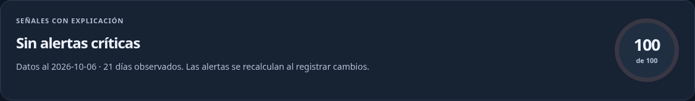

# Integración de licencias y Mercado Pago — preparación

El servidor de prueba está en [servidor-licencias](servidor-licencias/CONFIGURAR_EN_CLOUDFLARE.md). Pasó 14 pruebas locales simuladas. Falta desplegarlo y probarlo con Mercado Pago; el instalador 4.3.2 de esta rama todavía no aplica las restricciones. La integración del nuevo cliente Windows sigue pendiente.

---

# Descargar Control Emprende 4.3.2

Esta rama contiene la entrega de la aplicación y el sitio. Para descargar todo desde GitHub, pulsa **Code → Download ZIP**.

## Corrección de esta versión

El indicador del asesor ahora tiene fondo y texto adaptados al tema: el valor se lee en modo oscuro y la etiqueta es más grande. Se verificaron 18 combinaciones de puntaje, tema y ancho de pantalla, sin desbordamiento. En «Aprendiendo» se muestra un guion hasta reunir 14 días y 5 ventas.

## Obtener el instalador en Windows

1. Descarga el ZIP de esta rama y **extrae todo su contenido** en una carpeta.
2. Dentro de esa carpeta, abre **PREPARAR-INSTALADOR.cmd**. No lo ejecutes desde la vista del ZIP sin extraer.
3. Espera el mensaje **Listo**. Aparecerá **Control-Emprende-4.3.2-Windows-x64-Instalador.exe** en la misma carpeta.
4. Abre el `.exe` para instalar la aplicación en Windows 10 u 11 de 64 bits.

El preparador usa las herramientas incluidas en Windows, funciona sin Internet, comprueba SHA-256 y no instala ni abre la aplicación automáticamente. El ejecutable se almacena en varios fragmentos porque supera el límite de un archivo de GitHub; el resultado es el instalador original completo.

**Estado:** instalador sin firma digital. La compilación y los datos de descarga se verificaron en Linux; tanto la instalación como el preparador `.cmd` necesitan validación en Windows. No se cambian políticas de ejecución ni protecciones de Windows.

## Actualizar la página pública

Si Cloudflare todavía descarga un HTML o muestra «Probar en línea», sigue [los pasos para publicar la carpeta sitio](PUBLICAR_EN_CLOUDFLARE.md). Subir esta entrega a GitHub no actualiza un proyecto de carga manual en Cloudflare.

## Sitio y fuentes

- `sitio/`: carpeta lista para subir a Cloudflare Pages. Contiene la web de presentación y la descarga del instalador; no ofrece una demo web. Sube la carpeta completa, con `index.html` en la raíz del despliegue.
- `Control_Emprende_4.3.2_Fuentes.zip`: fuentes de la aplicación, scripts y pruebas.
- `LEEME_ENTREGA.md`: cambios, funcionamiento local y compilación.
- `FIRMA_DIGITAL_CHILE.md`: estado y pasos pendientes para contratar la firma.

La aplicación empieza vacía para usar datos propios. El inicio separa Resumen, Accesos rápidos y Seguimiento, con tarjetas y grupos visibles en tema claro y oscuro.

Esta entrega en GitHub no actualiza la página pública de Cloudflare. El flujo Next.js existente pertenece al repositorio original y no se usa para desplegar este paquete.
